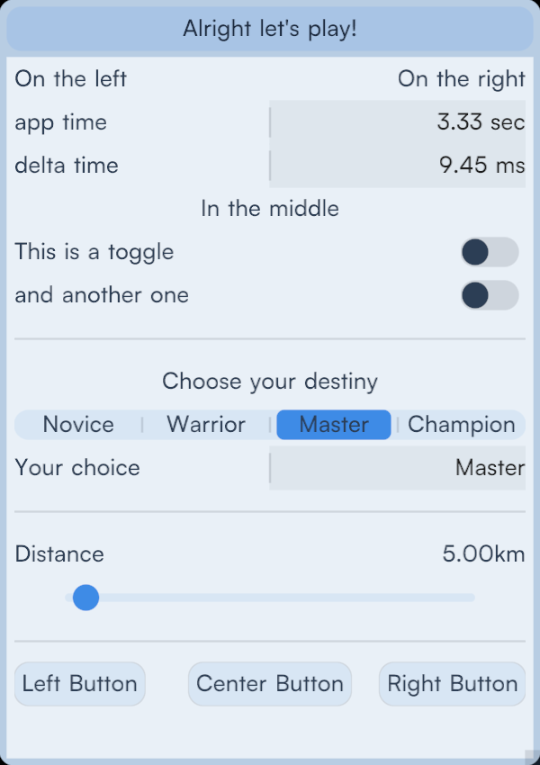
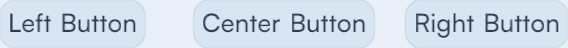
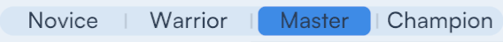
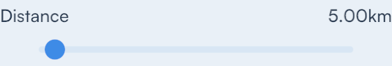

# leanUI


leanUI is a small immediate-mode UI library written in C99.  
It’s designed for games and lightweight applications that need a clean, polished interface without bringing in a full framework.




---

## Overview

- Immediate-mode API (rendering is also immediate, now command list to traverse, easier to integrate your own rendering)
- No allocations, no dependencies beyond the C standard library
- Single header / single source, easy to drop into any project 
- Built-in easing and animation for a smooth, modern feel
- A focused set of well-designed widgets  
- ~500 lines of code, compiles in seconds
- Low memory footprint ~3kb as the lib does not store any data for widget and don't use hashmap

---

## Widgets

leanUI provides a small, cohesive set of widgets:

- **Buttons** — with hover and press animations



- **Labels / value fields** — for clean key–value layouts  
- **Toggles** — animated switches inspired by iOS


- **Segmented controls** — for mode switching



- **Sliders** 



Each widget is built with consistent spacing, alignment, and interaction patterns.  
The goal is not to cover everything, but to make a minimal set look and feel right out of the box.

---

## Animation & Easing

Unlike most tiny immediate-mode UI libraries, leanUI has animation built in:

- Hover, press and toggle states are automatically eased over time.
- Animation framerate independant, uses delta time between frames.
- No per-widget state is stored — transitions are computed implicitly based on widget identity.  
  
This gives small UIs a fluid, modern feel without adding complexity to your code.

---

## Layout

Very simple and effective (no rows, no columns)
- Horizontal alignment : left, center or right
- Manually call to ui_newline to make a carriage return

## Example

For a complete and compiling example see [test/test.c](test/test.c)

```c
#include "lean_ui.h"

void frame(ui_context* ctx, float delta_time)
{
    ui_begin_frame(ctx, 1.f/60.f);
    ui_begin_window(ctx, "Alright let's play!", 800, 100, 600, 1200, window_resizable);

    const char* list[] = {"One", "Two", "Three", "Four"};
    static uint32_t selected = 2;
    ui_segmented(ctx, list, 4, &selected);

    ui_separator(ctx);

    static float quantity = 5.f;
    ui_slider(ctx, "Distance", 0.f, 100.f, 1.f, &quantity, "%3.2fkm");

    if (ui_button(ctx, "Left Button", align_left))
    {
        // process
    }

    ui_end_window(ctx);
    ui_end_frame(ctx);
}


```

