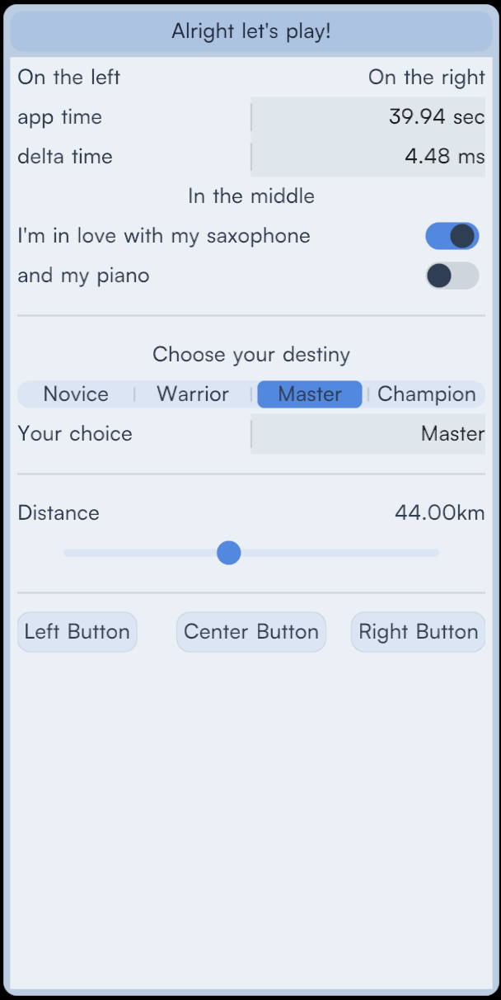

# LeanUI

LeanUI is a small immediate-mode UI library written in C99.  
It’s designed for games and lightweight applications that need a clean, polished interface without bringing in a full framework.


---

## Overview

- Immediate-mode API  
- No allocations, no dependencies beyond the C standard library  
- Single header / single source, easy to drop into any project  
- Built-in easing and animation for a smooth, modern feel  
- A focused set of well-designed widgets  
- ~500 lines of code, compiles in seconds

LeanUI aims to sit between *microui’s minimalism* and *modern UI polish*.  
It’s not a giant toolkit, but it’s not barebones either.

---

## Widgets

LeanUI provides a small, cohesive set of widgets:

- **Buttons** — with hover and press animations  
- **Labels / value fields** — for clean key–value layouts  
- **Toggles** — animated switches inspired by iOS  
- **Segmented controls** — for mode switching  

Each widget is built with consistent spacing, alignment, and interaction patterns.  
The goal is not to cover everything, but to make a minimal set look and feel right out of the box.



---

## Animation & Easing

Unlike most tiny immediate-mode UI libraries, LeanUI has animation built in:

- Hover, press, and toggle states are automatically eased over time.  
- New windows and panels animate smoothly when they appear.  
- No per-widget state is stored — transitions are computed implicitly based on widget identity.  
- Common easing functions (e.g. quadratic, overshoot) are included.

This gives small UIs a fluid, modern feel without adding complexity to your code.

---

## Example

```c
#include "lean_ui.h"

void frame(void)
{
    ui_begin();

    if (ui_button("Click Me")) {
        // Handle button press
    }

    ui_end();
}
